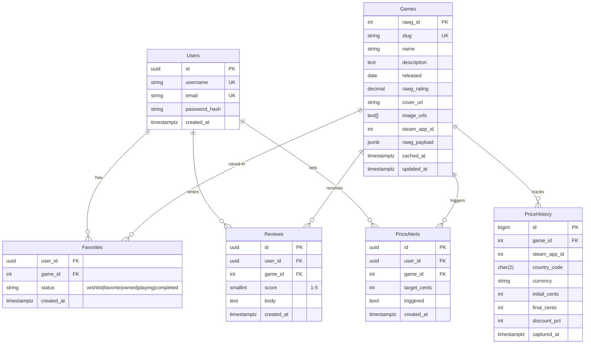

# 🎮 GameRune Backend

> ASP.NET Core 10 minimal-API backend for GameRune — game discovery, details aggregation, and pricing. Proxies and normalizes data from [RAWG](https://rawg.io/apidocs) and [Steam Store](https://store.steampowered.com/) for the GameRune frontend.

[](https://dotnet.microsoft.com/)
[](https://learn.microsoft.com/aspnet/core/)
[](./Dockerfile)
[](./render.yaml)
[](./LICENSE)

**Live API:** `https://gamerune-backend.onrender.com` *(example — replace with your Render URL)*
**Frontend:** `https://gamerune.vercel.app`
**Swagger (dev):** `http://localhost:5054/swagger`

---

## 📑 Table of Contents

- [Features](#-features)
- [Architecture](#-architecture)
- [Tech Stack](#-tech-stack)
- [API Reference](#-api-reference)
- [Database](#-database)
- [Getting Started](#-getting-started)
- [Configuration](#-configuration)
- [Running with Docker](#-running-with-docker)
- [Deployment](#-deployment-render)
- [Project Structure](#-project-structure)
- [Rate Limiting & CORS](#-rate-limiting--cors)
- [Roadmap](#-roadmap)
- [Contributing](#-contributing)

---

## ✨ Features

### Implemented

- 📃 **Game listing** — paginated `GET /games` backed by RAWG, normalized to a lean `GameDto`.
- 🔍 **Search + hydrate** — `GET /games/search/details` searches RAWG then hydrates each hit into a full detail object (description, screenshots, Steam price).
- 📄 **Game details aggregation** — `GET /games/{id}` merges in one response:
  - RAWG detail (`description`, `released`, `rating`)
  - Up to 3 images (cover + screenshots)
  - Steam `appId` resolved via RAWG `/stores` endpoint
  - Live Steam price via `store.steampowered.com/api/appdetails` with `cc={countryCode}`
  - Free-to-play handling (`FinalFormatted: "Free"`)
- 🛡️ **Rate limiting** — fixed-window `GameApi` policy (default 60 req/min, configurable).
- 🌐 **CORS** — allow-listed for local dev ports + `https://gamerune.vercel.app`.
- 📘 **OpenAPI / Swagger** — Swashbuckle + built-in OpenAPI in Development.
- 🔑 **Flexible API-key loading** — `RAWG_API_KEY` env var → `.env` file → `appsettings.json` (`Rawg:ApiKey`).
- 🐳 **Docker + Render ready** — multi-stage Dockerfile, `PORT`-aware startup, `render.yaml` blueprint.

### Complete-project vision (v1.0)

- 👤 Auth + users (JWT, ASP.NET Identity)
- ⭐ Favorites / wishlist / owned library per user
- 📝 Reviews & ratings (user reviews alongside RAWG rating)
- 💾 Cached game catalog in Postgres (reduces RAWG quota usage)
- ⏰ Background price-sync worker (refresh Steam prices hourly)
- 🔔 Price-drop alerts

---

## 🏗️ Architecture

```text
                    ┌──────────────────┐
                    │ GameRune Frontend│
                    │  (Vercel / SPA)  │
                    └────────┬─────────┘
                             │ HTTPS / CORS
                             ▼
                    ┌──────────────────┐
                    │ GameRune Backend │  ← this repo (ASP.NET Core 10)
                    │  Minimal API     │
                    │  Rate Limiter    │
                    └────┬───────┬─────┘
                         │       │
              ┌──────────┘       └──────────┐
              ▼                             ▼
    ┌──────────────────┐          ┌──────────────────┐
    │   RAWG API       │          │  Steam Store API │
    │  games, details, │          │  appdetails +    │
    │  screenshots,    │          │  price_overview  │
    │  stores          │          │                  │
    └──────────────────┘          └──────────────────┘
              │
              ▼ (v1.0)
    ┌──────────────────┐
    │   PostgreSQL 16  │  ← EF Core: cache + users + favorites + reviews
    │  (Render Postgres)│
    └──────────────────┘
```

Request flow for `GET /games/{id}`:

1. Validate `id` → look up `RAWG_API_KEY`.
2. `GET https://api.rawg.io/api/games/{id}?key=...` → base detail.
3. Parallel: `GET .../games/{id}/stores` → extract Steam `appId` from `store.steampowered.com/app/{appId}/...` URL.
4. Parallel: `GET .../games/{id}/screenshots` → take cover + screenshots, `Distinct().Take(3)`.
5. If `appId` found: `GET https://store.steampowered.com/api/appdetails?appids={id}&cc={countryCode}&filters=basic,price_overview`.
6. Return unified `GameDetailDto`.

---

## 🧰 Tech Stack

| Layer | Choice |
|---|---|
| Runtime | .NET 10 / ASP.NET Core Minimal APIs |
| Docs | Swashbuckle + Microsoft.AspNetCore.OpenApi |
| HTTP | `IHttpClientFactory` named clients (`Rawg`, `Steam`) |
| DB (v1.0 complete) | PostgreSQL 16 + Entity Framework Core 10 (`Npgsql.EntityFrameworkCore.PostgreSQL`) |
| Auth (v1.0 complete) | ASP.NET Core Identity + JWT Bearer |
| Hosting | Docker (multi-stage) → Render Web Service |
| Frontend | Separate repo, deployed on Vercel |

---

## 📡 API Reference

Base URL (local): `http://localhost:5054`

| Method | Endpoint | Description | Rate limited |
|---|---|---|---|
| `GET` | `/games?page=1&pageSize=20&search=` | Paginated game list | ✅ `GameApi` |
| `GET` | `/games/search/details?query=elden+ring&page=1&pageSize=5&countryCode=US` | Search + hydrated details | ✅ `GameApi` |
| `GET` | `/games/{id}?countryCode=US` | Full detail by RAWG id or slug | ✅ `GameApi` |

### `GET /games`

```http
GET /games?page=1&pageSize=20&search=witcher HTTP/1.1
Host: localhost:5054
```

```json
{
  "count": 10234,
  "next": "https://api.rawg.io/api/games?...&page=2",
  "previous": null,
  "results": [
    { "id": 3328, "name": "The Witcher 3: Wild Hunt", "imageUrl": "https://media.rawg.io/..." }
  ]
}
```

Query params: `page >= 1` (default `1`), `pageSize 1–40` (default `20`), `search` optional.

### `GET /games/{id}`

```http
GET /games/3328?countryCode=US HTTP/1.1
Host: localhost:5054
```

```json
{
  "id": 3328,
  "name": "The Witcher 3: Wild Hunt",
  "imageUrl": "https://media.rawg.io/...",
  "imageUrls": [
    "https://media.rawg.io/...",
    "https://media.rawg.io/...",
    "https://media.rawg.io/..."
  ],
  "description": "You are Geralt of Rivia...",
  "released": "2015-05-18",
  "rating": 4.67,
  "steamAppId": 292030,
  "steamPrice": {
    "currency": "USD",
    "initial": 3999,
    "final": 999,
    "discountPercent": 75,
    "initialFormatted": "$39.99",
    "finalFormatted": "$9.99"
  }
}
```

- `id` accepts a RAWG numeric id (`3328`) or slug (`the-witcher-3-wild-hunt`).
- `countryCode` is an ISO-2 Steam store code (`US`, `GB`, `DE`, …), default `US`.
- `steamAppId` / `steamPrice` are `null` when no Steam store link exists or Steam returns `success: false`.
- Free games return `"finalFormatted": "Free"` with `initial: 0, final: 0`.

### Error shapes

| Status | When |
|---|---|
| `400` | missing `query` / `id` → `{ "message": "Search query is required." }` |
| `404` | RAWG game not found → `{ "message": "Game was not found." }` |
| `429` | `GameApi` fixed-window exceeded |
| `500` | `RAWG_API_KEY` not configured |
| `502` | upstream RAWG request failed |

---

## 🗄️ Database

> **Status:** the current code is stateless (no DB — it proxies RAWG + Steam live on every request). This section documents the **complete-project (v1.0) schema** so the repo reads as a finished product and can be implemented without redesign.

### Why a database?

1. **Cache RAWG catalog** — avoid burning the RAWG quota on repeat queries.
2. **Users & libraries** — favorites, wishlist, owned, playtime tracking.
3. **Reviews** — first-party ratings to complement RAWG scores.
4. **Price history** — scheduled Steam sync + price-drop alerts.

### Choice: PostgreSQL 16

- Native `citext` / case-insensitive search, `pg_trgm` for fuzzy game search.
- `jsonb` for raw RAWG / Steam payloads (audit + re-hydration).
- Works on Render Postgres, Neon, Supabase, or local Docker.
- EF Core provider: `Npgsql.EntityFrameworkCore.PostgreSQL`.

### ER diagram



### DDL (PostgreSQL)

Apply with `psql`, or let EF Core migrations generate it (`dotnet ef migrations add InitialCreate`).

```sql
CREATE EXTENSION IF NOT EXISTS pg_trgm;

CREATE TABLE "Users" (
  "Id" uuid PRIMARY KEY DEFAULT gen_random_uuid(),
  "Username" citext NOT NULL UNIQUE,
  "Email" citext NOT NULL UNIQUE,
  "PasswordHash" text NOT NULL,
  "CreatedAt" timestamptz NOT NULL DEFAULT now()
);

CREATE TABLE "Games" (
  "RawgId" integer PRIMARY KEY,
  "Slug" citext NOT NULL UNIQUE,
  "Name" text NOT NULL,
  "Description" text NULL,
  "Released" date NULL,
  "RawgRating" numeric(3,2) NULL,
  "CoverUrl" text NULL,
  "ImageUrls" text[] NOT NULL DEFAULT '{}',
  "SteamAppId" integer NULL,
  "RawgPayload" jsonb NULL,
  "CachedAt" timestamptz NOT NULL DEFAULT now(),
  "UpdatedAt" timestamptz NOT NULL DEFAULT now()
);
CREATE INDEX "IX_Games_Name_Trgm" ON "Games" USING gin ("Name" gin_trgm_ops);

CREATE TABLE "Favorites" (
  "UserId" uuid NOT NULL REFERENCES "Users"("Id") ON DELETE CASCADE,
  "GameId" integer NOT NULL REFERENCES "Games"("RawgId") ON DELETE CASCADE,
  "Status" text NOT NULL DEFAULT 'wishlist'
    CHECK ("Status" IN ('wishlist','favorite','owned','playing','completed')),
  "CreatedAt" timestamptz NOT NULL DEFAULT now(),
  PRIMARY KEY ("UserId", "GameId")
);

CREATE TABLE "Reviews" (
  "Id" uuid PRIMARY KEY DEFAULT gen_random_uuid(),
  "UserId" uuid NOT NULL REFERENCES "Users"("Id") ON DELETE CASCADE,
  "GameId" integer NOT NULL REFERENCES "Games"("RawgId") ON DELETE CASCADE,
  "Score" smallint NOT NULL CHECK ("Score" BETWEEN 1 AND 5),
  "Body" text NULL,
  "CreatedAt" timestamptz NOT NULL DEFAULT now(),
  UNIQUE ("UserId", "GameId")
);

CREATE TABLE "PriceHistory" (
  "Id" bigserial PRIMARY KEY,
  "GameId" integer NOT NULL REFERENCES "Games"("RawgId") ON DELETE CASCADE,
  "SteamAppId" integer NOT NULL,
  "CountryCode" char(2) NOT NULL DEFAULT 'US',
  "Currency" text NOT NULL,
  "InitialCents" integer NOT NULL,
  "FinalCents" integer NOT NULL,
  "DiscountPct" integer NOT NULL DEFAULT 0,
  "CapturedAt" timestamptz NOT NULL DEFAULT now()
);
CREATE INDEX "IX_PriceHistory_Game_Captured" ON "PriceHistory" ("GameId", "CapturedAt" DESC);

CREATE TABLE "PriceAlerts" (
  "Id" uuid PRIMARY KEY DEFAULT gen_random_uuid(),
  "UserId" uuid NOT NULL REFERENCES "Users"("Id") ON DELETE CASCADE,
  "GameId" integer NOT NULL REFERENCES "Games"("RawgId") ON DELETE CASCADE,
  "TargetCents" integer NOT NULL,
  "Triggered" boolean NOT NULL DEFAULT false,
  "CreatedAt" timestamptz NOT NULL DEFAULT now()
);
```

### Wiring it up (EF Core — planned)

```bash
# 1. Add packages
dotnet add package Npgsql.EntityFrameworkCore.PostgreSQL
dotnet add package Microsoft.EntityFrameworkCore.Design
dotnet add package Microsoft.AspNetCore.Identity.EntityFrameworkCore

# 2. Configure connection
# appsettings.json:
# "ConnectionStrings": { "Default": "Host=localhost;Database=gamerune;Username=postgres;Password=postgres" }
# or env: ConnectionStrings__Default / DATABASE_URL (Render)

# 3. Scaffold + migrate
dotnet ef migrations add InitialCreate -o Data/Migrations
dotnet ef database update
```

Planned `DbContext` location: `Data/GameRuneDbContext.cs` with `DbSet<Game>`, `DbSet<Favorite>`, `DbSet<Review>`, `DbSet<PriceHistoryEntry>`, `DbSet<PriceAlert>`.

Planned v1.0 endpoints on top of this schema:

```text
POST   /auth/register, POST /auth/login
GET    /me/favorites  POST /me/favorites  DELETE /me/favorites/{rawgId}
GET    /games/{id}/reviews   POST /games/{id}/reviews
GET    /games/{id}/price-history?countryCode=US
POST   /games/{id}/alerts
```

---

## 🚀 Getting Started

### Prerequisites

- [.NET 10 SDK](https://dotnet.microsoft.com/download) (`dotnet --version` → `10.x`)
- A free [RAWG API key](https://rawg.io/apidocs)
- Optional: Docker Desktop, `psql` / PgAdmin (for the v1.0 DB)

### 1. Clone

```bash
git clone git@github.com:Penquinz01/gamerune-backend.git
cd gamerune-backend
```

### 2. Configure key

```bash
cp .env.example .env
# then edit .env:
# RAWG_API_KEY=your_key_here
```

Priority order (see `Configuration/ApiKeys.cs`): **environment variable** `RAWG_API_KEY` → `.env` file (`Configuration/EnvFile.cs`) → `appsettings.json` (`Rawg:ApiKey`).

### 3. Run

```bash
dotnet restore
dotnet run
# Swagger: http://localhost:5054/swagger  (dev)
```

Quick smoke test:

```bash
curl "http://localhost:5054/games?page=1&pageSize=5"
curl "http://localhost:5054/games/3328?countryCode=US"
curl "http://localhost:5054/games/search/details?query=elden%20ring&pageSize=2"
```

---

## ⚙️ Configuration

| Key | Source | Default | Description |
|---|---|---|---|
| `RAWG_API_KEY` | env / `.env` / `Rawg:ApiKey` | — (required) | RAWG API key |
| `Cors:AllowedOrigins` | `appsettings.json` | `localhost:3000,5173,4200` | Frontend origins |
| `RateLimiting:GameApi:PermitLimit` | `appsettings.json` | `60` | Requests per window |
| `RateLimiting:GameApi:WindowSeconds` | `appsettings.json` | `60` | Window size (s) |
| `RateLimiting:GameApi:QueueLimit` | `appsettings.json` | `0` | Queued requests |
| `ConnectionStrings:Default` | env / user-secrets (v1.0) | — | Postgres connection string |
| `PORT` | Render / env | `5054` (dev) | Listening port (`Program.cs` binds `0.0.0.0:$PORT`) |

Production overrides use environment variables with `__` nesting, e.g. `RateLimiting__GameApi__PermitLimit=120`.

---

## 🐳 Running with Docker

```bash
# Build
docker build -t gamerune-backend .

# Run (passes RAWG key through)
docker run --rm -p 10000:10000 \
  -e PORT=10000 \
  -e RAWG_API_KEY=your_key_here \
  gamerune-backend

curl "http://localhost:10000/games?pageSize=3"
```

The image is multi-stage (`sdk:10.0` → `aspnet:10.0`), exposes `10000`, and runs `GameListerBackend.dll` with `ASPNETCORE_ENVIRONMENT=Production`.

---

## ☁️ Deployment (Render)

`render.yaml` defines a Docker web service:

```yaml
services:
  - type: web
    name: game-lister-backend
    runtime: docker
    plan: free
    envVars:
      - key: ASPNETCORE_ENVIRONMENT
        value: Production
      - key: RAWG_API_KEY
        sync: false   # set in Render dashboard
```

Steps:

1. Push to GitHub.
2. Render → **New → Blueprint** → select repo (picks up `render.yaml`).
3. Set `RAWG_API_KEY` in the Render dashboard (sync: false means manual).
4. Deploy. For v1.0, add a **Render Postgres** instance and set `ConnectionStrings__Default` / `DATABASE_URL`.

---

## 📁 Project Structure

```text
gamerune-backend/
├── Program.cs                  # Minimal API: /games, /games/search/details, /games/{id} + helpers
├── Configuration/
│   ├── ApiKeys.cs              # Env → appsettings key resolution (RAWG_API_KEY)
│   └── EnvFile.cs              # Lightweight .env loader (dev convenience)
├── Models/
│   ├── GameDto.cs              # List item { id, name, imageUrl }
│   ├── GamesResponse.cs        # Paginated list envelope
│   ├── GameDetailDto.cs        # Aggregated detail + Steam price
│   ├── GameDetailSearchResponse.cs
│   ├── RawgGamesResponse.cs    # RAWG list shape
│   ├── RawgGameDetail.cs       # RAWG detail shape
│   ├── RawgGameStoresResponse.cs
│   ├── RawgScreenshotsResponse.cs
│   └── SteamAppDetailsResponse.cs
├── Data/                       # (v1.0) GameRuneDbContext + Migrations
├── Dockerfile                  # Multi-stage .NET 10 build
├── render.yaml                 # Render blueprint
├── appsettings.json
├── appsettings.Development.json
├── .env.example
└── README.md
```

---

## ⏱️ Rate Limiting & CORS

- **Rate limiting:** `AddFixedWindowLimiter("GameApi")` — 60 req / 60 s by default, `RejectionStatusCode: 429`, no queue. Tune via `RateLimiting:GameApi` in config.
- **CORS:** named policy `Frontend`, `AllowAnyHeader + AllowAnyMethod`, origins from `Cors:AllowedOrigins`. Add your production Vercel URL there or via env: `Cors__AllowedOrigins__3=https://gamerune.vercel.app`.

---

## 🗺️ Roadmap

- [x] RAWG list / search / detail proxy
- [x] Steam price aggregation + screenshots
- [x] Rate limiting, CORS, Swagger, Docker, Render
- [ ] PostgreSQL + EF Core cache layer (`Data/`)
- [ ] Auth (Identity + JWT) + `/me/*` library endpoints
- [ ] Reviews + price history + alerts
- [ ] Background worker (`IHostedService`) for price sync
- [ ] Redis response caching + ETag support
- [ ] Tests (xUnit + WebApplicationFactory) + CI workflow

---

## 🤝 Contributing

1. Fork → branch (`feat/…`, `fix/…`).
2. `dotnet format` + `dotnet build`.
3. Open a PR describing the endpoint / schema change with a `curl` example.

---

## 📄 License

MIT — see [LICENSE](./LICENSE) *(add one if missing: `dotnet new gitignore` already covers build artifacts)*.

## 🙏 Credits

- Game metadata: [RAWG](https://rawg.io/)
- Prices: [Steam Store API](https://store.steampowered.com/)
- Built with [ASP.NET Core](https://learn.microsoft.com/aspnet/core/) 10
